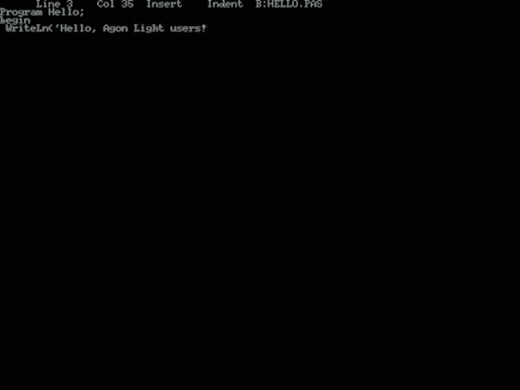

# CP/M 2.2 for Agon Light

This is port of CP/M 2.2 for Agon Light(and Agon Light 2) that didn't require reflashing VDP.

It starts directly from MOS as application(exit only via RESET) and uses MOS's filesystem drivers for working with drive images.

## Usage

Create some directory on Agon's SD card, put `cpm.bin` and disk images(**TO THE SAME DIRECTORY**) that will be named `cpma.dsk`, `cpmb.dsk` etc, drives from `A:` to `P:` are supported. 

Load and run binary and you'll be in CP/M's wonderland.

## Working with images

I'm using [cpmtools](https://github.com/lipro-cpm4l/cpmtools) for working with CP/M drive images.

Disk definition can be copied from `diskdefs` file(in `disks` directory).

For new drives better use template.dsk(make copy with proper naming and copy yourown files to it). 

## Development

Make sure that you **really want it**.

Build process have 2 stages. Building CP/M itself(`sources` directory) - you'll need [sjasmplus](https://github.com/z00m128/sjasmplus). As result - you'll got `cpm.sys` file that should be placed to directory with bootstrap source. 

Bootstrap can be built with [ez80asm](https://github.com/envenomator/agon-ez80asm). Better use latest version.

As result - you'll got `cpm.bin` executable that will include bootstrap and system both.

## Important remarks

BIOS and CP/M core should be aligned by 256 bytes.

If you'll make some changes in code - make sure that bios starts from 0xXX00 address. In other case - you'll die until you find issue why software got broken.

All terminal issues caused by current VDP implementation. They can be fixed soon. 

## Licensing

CP/M itself [opensourced](https://www.theregister.com/2001/11/26/cp_m_collection_is_back/) and free for redistribution. 

My parts of code licensed as usual under [Coffeeware License](LICENSE). 